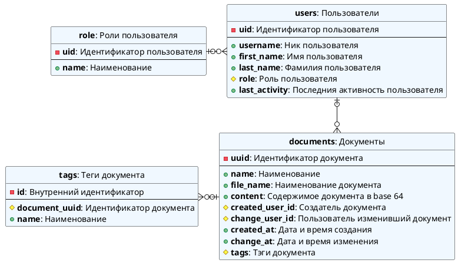

```plantuml
@startuml

' ========== Общие настройки ==========
hide circle
hide empty members
skinparam linetype ortho
skinparam class {
  BackgroundColor AliceBlue
}

' ========== Сущности ===========
entity "**users**: Пользователи" as users {
  {method}- **uid**: Идентификатор пользователя
  --
  {method}+ **username**: Ник пользователя
  {method}+ **first_name**: Имя пользователя
  {method}+ **last_name**: Фамилия пользователя
  {method}# **role**: Роль пользователя
  {method}+ **last_activity**: Последния активность пользователя
}

entity "**role**: Роли пользователя" as role {
  {method}- **uid**: Идентификатор пользователя
  --
  {method}+ **name**: Наименование
}

entity "**documents**: Документы" as documents {
  {method}- **uuid**: Идентификатор документа
  --
  {method}+ **name**: Наименование
  {method}+ **file_name**: Наименование документа
  {method}+ **content**: Содержимое документа в base 64
  {method}# **created_user_id**: Создатель документа
  {method}# **change_user_id**: Пользователь изменивший документ
  {method}+ **created_at**: Дата и время создания
  {method}+ **change_at**: Дата и время изменения
  {method}# **tags**: Тэги документа
}

entity "**tags**: Теги документа" as tags {
  {method}- **id**: Внутренний идентификатор
  --
  {method}# **document_uuid**: Идентификатор документа
  {method}+ **name**: Наименование
}

' ========== Отношения ==========
users }o-left-o| role
users |o-down-o{ documents
documents |o-left-o{ tags

@enduml
```